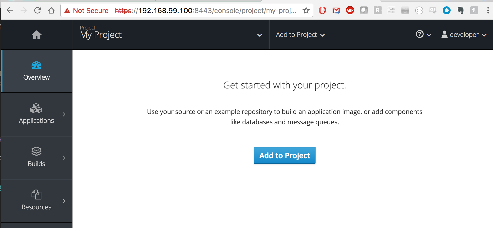
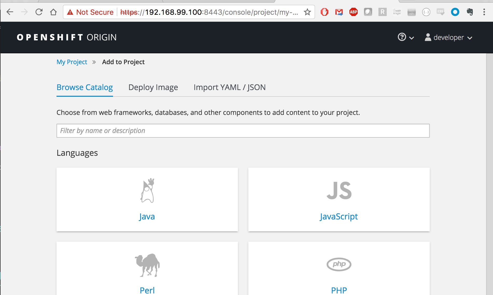

# nodejs-hello-world

**A simple and stateless "Hello World" Application written in Node.js used to illustrate OpenShift functionality**

## Prerequisites
- MiniShift environment is up and running
- See [Lesson 1 - Install and run Minishift](https://github.com/bugbiteme/openshift_tutorials) for instructions on how to install and run MiniShift 

## Relevent files we will be looking at

- server.js - Node.js server
- views/index.html - Node.js/HTML view

## Overview
- TODO: graphic showing how code is deployed from github

## Deploying an application to OpenShift
### CLI Method

* Log into OpenShift/Minishift
 
        $ oc login https://192.168.99.100:8443
        Authentication required for https://192.168.99.100:8443 (openshift)
        Username: developer
        Password: developer
        Login successful.

        You have one project on this server: "my-project"

        Using project "my-project".
    
my-project is the default new project living in the minishift environment

* Using the default project (my-project) deploy the app located here in github

        oc new-app https://github.com/bugbiteme/nodejs-hello-world -l name=myapp
        
app will build and deploy to OpenShift/MiniShift

    Node.js 6 
    --------- 
    Node.js 6 available as docker container is a base platform for building and running various Node.js 6 applications and frameworks. Node.js is a platform built on Chrome's JavaScript runtime for easily building fast, scalable network applications. Node.js uses an event-driven, non-blocking I/O model that makes it lightweight and efficient, perfect for data-intensive real-time applications that run across distributed devices.

    Tags: builder, nodejs, nodejs6

    * The source repository appears to match: nodejs
    * A source build using source code from https://github.com/bugbiteme/nodejs-hello-world will be created
    * The resulting image will be pushed to image stream "nodejs-hello-world:latest"
    * Use 'start-build' to trigger a new build
    * This image will be deployed in deployment config "nodejs-hello-world"
    * Port 8080/tcp will be load balanced by service "nodejs-hello-world"
    * Other containers can access this service through the hostname "nodejs-hello-world"

    --> Creating resources with label name=myapp ...
        imagestream "nodejs-hello-world" created
        buildconfig "nodejs-hello-world" created
        deploymentconfig "nodejs-hello-world" created
        service "nodejs-hello-world" created
    --> Success
        Build scheduled, use 'oc logs -f bc/nodejs-hello-world' to track its progress.
        Run 'oc status' to view your app.
* From here, OpenShift will pull the code from github, build and deploy the application. 
* You can check the build status of the newly deployed app by running the following command

        $ oc logs -f bc/nodejs-hello-world
      
*Example:*
         
    $ oc logs -f bc/nodejs-hello-world
    
     Cloning "https://github.com/bugbiteme/nodejs-hello-world" ...
	          Commit:	145f3bdbdecb49b735a602aedeb679c1747d5b51 (images)
	          Author:	Leon Levy <leon.s.levy@gmail.com>
	          Date:	Tue Oct 17 10:21:20 2017 -0700
     ---> Installing application source ...
     ---> Building your Node application from source
     .
     .
     .
     Pushing image 172.30.1.1:5000/my-project/nodejs-hello-world:latest ...
     Pushed 0/9 layers, 0% complete
     Pushed 1/9 layers, 11% complete
     Push successful

* Once the application has been deployed, we must create a route to it, so users can access the deployed application's web interface

        $ oc expose svc/nodejs-hello-world
        route "nodejs-hello-world" exposed
        
* Now lets use minishift to access the application

        $ minishift openshift service nodejs-hello-world  --in-browser
        Opening the route/NodePort http://nodejs-hello-world-my-project.192.168.99.100.nip.io in the default browser...

### GUI Method

After starting up Mini/OpenShift, point your web browser to the IP address shown at startup

*Example:*

    The server is accessible via web console at:
        https://192.168.99.100:8443

Login using the developer/developer credentials.

From here, click on the default project "My Project", or create a new project and open it.

Now click "Add to Project" to add a containerized application to the project.

You are deploying a Node.js application, which is written in JavaScript, so select that as the language.

This is a stateless Node.js app not using a database, so select "Node.js" and version "4", then click the "Select" button.

Enter the name of your application.  You are free to choose any name. "node-js-hello-world" was chosen for consistancy with this git repository.

Enter this git repository's URL:

    https://github.com/bugbiteme/nodejs-hello-world.git
    
Now click "Create"

*Note: "advanced options" is out of the scope of this turorial. The defaults are fine at this point, but feel free to poke around and look at the options avialable here. Some items can be modified after deployment*

Once you click "Create" OpenShift will pull the code fom github, build and deploy a single instance of the nodejs-hello-world application.

Click "Continue to overview" to see the status of the deployed application.

The below shows a high level view of the application pod. In this example the pod is one contaider running node-js-hello-world container. If an application is made up of mulitple deployed containers, you will see them all in the pod here.

Expand the "node-js-hello-world" container to see more information about the deployment.

One thing to take note of is the "ROUTES section uner "Networking". The URL listed is the URL of this application service, which happens to be the entry point to our application. Go ahead and click on the URL to see the application via the web browser.

*Application Screenshot*

*Note: More information on pods in the next section.*
 
## Scaling the application up and down
### CLI Method
### GUI Method

## Deploying changes to code ito application
### Rolling update (default method)
#### CLI Method
#### GUI Method

### Blue/Green Deployement
#### CLI Method
#### GUI Method
