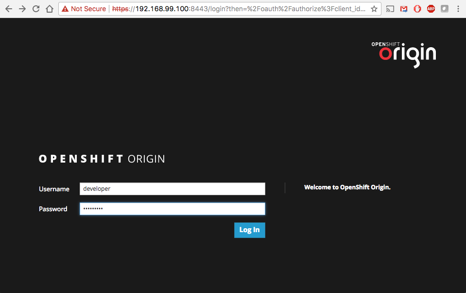
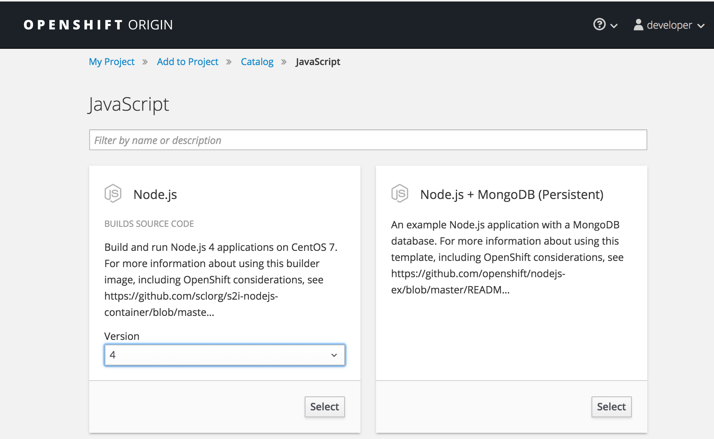
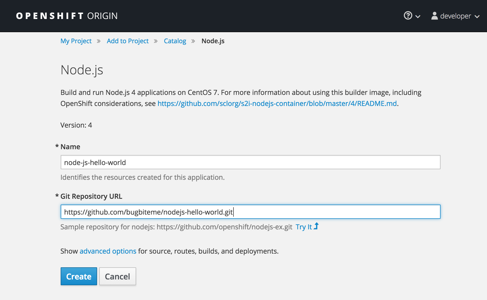
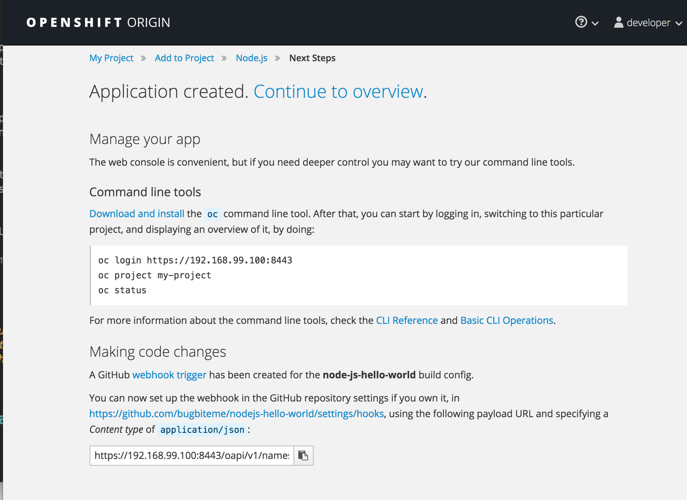
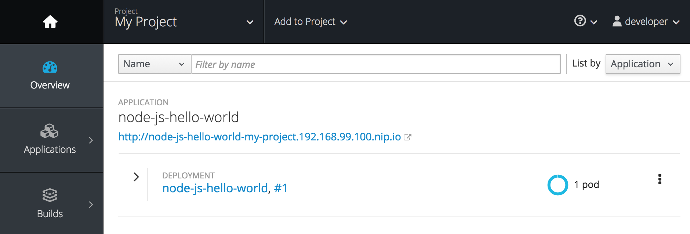
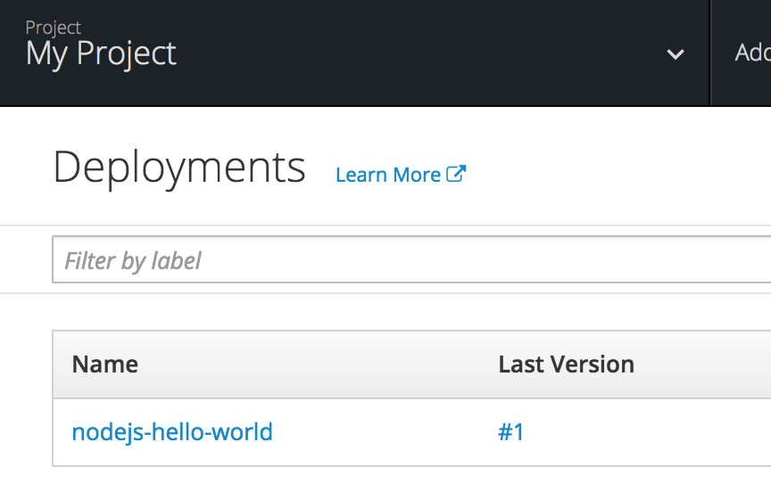
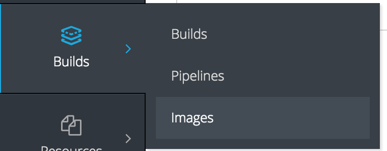
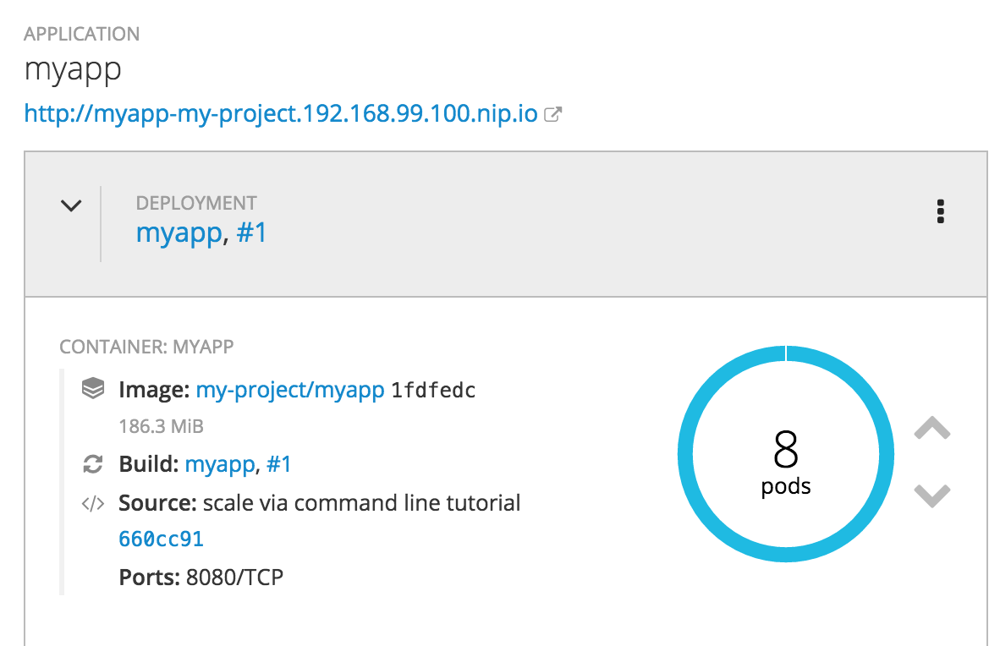
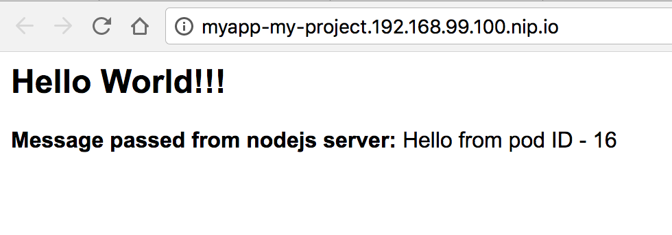

# nodejs-hello-world

**A simple and stateless "Hello World" Application written in Node.js used to illustrate OpenShift functionality**

## Prerequisites
- MiniShift environment is up and running
- See [Lesson 1 - Install and run Minishift](https://github.com/bugbiteme/openshift_tutorials) for instructions on how to install and run MiniShift 

## Relevent files we will be looking at

- server.js - Node.js server
- views/index.html - Node.js/HTML view

## Overview
- TODO: graphic showing how code is deployed from github

## Deploying an application to OpenShift
### CLI Method

* Log into OpenShift/Minishift
 
        $ oc login https://192.168.99.100:8443
        Authentication required for https://192.168.99.100:8443 (openshift)
        Username: developer
        Password: developer
        Login successful.

        You have one project on this server: "my-project"

        Using project "my-project".
    
my-project is the default new project living in the minishift environment

* Using the default project (my-project) deploy the app located here in github

        oc new-app https://github.com/bugbiteme/nodejs-hello-world -l name=myapp
        
app will build and deploy to OpenShift/MiniShift

    Node.js 6 
    --------- 
    Node.js 6 available as docker container is a base platform for building and running various Node.js 6 applications and frameworks. Node.js is a platform built on Chrome's JavaScript runtime for easily building fast, scalable network applications. Node.js uses an event-driven, non-blocking I/O model that makes it lightweight and efficient, perfect for data-intensive real-time applications that run across distributed devices.

    Tags: builder, nodejs, nodejs6

    * The source repository appears to match: nodejs
    * A source build using source code from https://github.com/bugbiteme/nodejs-hello-world will be created
    * The resulting image will be pushed to image stream "nodejs-hello-world:latest"
    * Use 'start-build' to trigger a new build
    * This image will be deployed in deployment config "nodejs-hello-world"
    * Port 8080/tcp will be load balanced by service "nodejs-hello-world"
    * Other containers can access this service through the hostname "nodejs-hello-world"

    --> Creating resources with label name=myapp ...
        imagestream "nodejs-hello-world" created
        buildconfig "nodejs-hello-world" created
        deploymentconfig "nodejs-hello-world" created
        service "nodejs-hello-world" created
    --> Success
        Build scheduled, use 'oc logs -f bc/nodejs-hello-world' to track its progress.
        Run 'oc status' to view your app.
* From here, OpenShift will pull the code from github, build and deploy the application. 
* You can check the build status of the newly deployed app by running the following command

        $ oc logs -f bc/nodejs-hello-world
      
*Example:*
         
    $ oc logs -f bc/nodejs-hello-world
    
     Cloning "https://github.com/bugbiteme/nodejs-hello-world" ...
	          Commit:	145f3bdbdecb49b735a602aedeb679c1747d5b51 (images)
	          Author:	Leon Levy <leon.s.levy@gmail.com>
	          Date:	Tue Oct 17 10:21:20 2017 -0700
     ---> Installing application source ...
     ---> Building your Node application from source
     .
     .
     .
     Pushing image 172.30.1.1:5000/my-project/nodejs-hello-world:latest ...
     Pushed 0/9 layers, 0% complete
     Pushed 1/9 layers, 11% complete
     Push successful

* Once the application has been deployed, we must create a route to it, so users can access the deployed application's web interface

        $ oc expose svc/nodejs-hello-world
        route "nodejs-hello-world" exposed
        
* Now lets use minishift to access the application

        $ minishift openshift service nodejs-hello-world  --in-browser
        Opening the route/NodePort http://nodejs-hello-world-my-project.192.168.99.100.nip.io in the default browser...

### GUI Method

After starting up Mini/OpenShift, point your web browser to the IP address shown at startup

*Example:*

    The server is accessible via web console at:
        https://192.168.99.100:8443

Login using the developer/developer credentials.

From here, click on the default project "My Project", or create a new project and open it.

Now click "Add to Project" to add a containerized application to the project.

You are deploying a Node.js application, which is written in JavaScript, so select that as the language.

This is a stateless Node.js app not using a database, so select "Node.js" and version "4", then click the "Select" button.

Enter the name of your application.  You are free to choose any name. "node-js-hello-world" was chosen for consistancy with this git repository.

Enter this git repository's URL:

    https://github.com/bugbiteme/nodejs-hello-world.git
    
Now click "Create"

*Note: "advanced options" is out of the scope of this turorial. The defaults are fine at this point, but feel free to poke around and look at the options avialable here. Some items can be modified after deployment*

Once you click "Create" OpenShift will pull the code fom github, build and deploy a single instance of the nodejs-hello-world application.

Click "Continue to overview" to see the status of the deployed application.

The below shows a high level view of the application pod. In this example the pod is one contaider running node-js-hello-world container. If an application is made up of mulitple deployed containers, you will see them all in the pod here.

Expand the "node-js-hello-world" container to see more information about the deployment.

One thing to take note of is the "ROUTES section uner "Networking". The URL listed is the URL of this application service, which happens to be the entry point to our application. Go ahead and click on the URL to see the application via the web browser.

*Application Screenshot*

*Note: More information on pods in the next section.*
 
## Scaling the application up and down

Reasons to use scaling in your application:

* Non-disruptive deployments
* Meet the demands of end users

### CLI Method
Scaling containers that make up an application deployment from one to many instances is easy from OpenShift CLI management console.

Check status on the number of application instances currently running, run the following command from the CLI:

    $ oc get dc nodejs-hello-world
    NAME                 REVISION   DESIRED   CURRENT   TRIGGERED BY
    nodejs-hello-world   1          1         1         config,image(nodejs-hello-world:latest)

After the initial deployment of our application, lets scale the number of instances from 1 to 3

`$ oc scale --replicas=3 dc nodejs-hello-world`

*Note: dc = deploymentConfig*

Now run the status command to verify the number of replicas have increased to the desired number:

    $ oc get dc nodejs-hello-world
    NAME                 REVISION   DESIRED   CURRENT   TRIGGERED BY
    nnodejs-hello-world   1          3         3         config,image(nodejs-hello-world:latest)
    
From the web GUI you can also see the number of pods (aka "instnances" or "replicas") has changed from 1 to 3.

Use the same command when you want to scale down bu setting the `--replicas` flag to the desired number of instances.

*Note: Although we are doing this manually in the tutorial, this process can be automated to scale as demand fluctuates*

### GUI Method
Scaling containers that make up an application deployment from one to many instances is very straight forward from the OpenShift GUI management console.

* from the Overview tab, expand the *node-js-hello-world* deployment

* You can see the container: NODE-JS-HELLO-WORLD is currently scaled to one pod. In order to scale it to more instances, simply click the up arrow next to the blue circle to scale the application to more instances/pods.

* scroll down further to get more information about the pods running for the deployment

* You can experiment and scale the number of pods up and down. Note that you can open the deployed application in different browser tabs, and where you see the text *Hello from pod ID - X*, X will be the same in all tabs if only one pod is running, but will change in the different tabs based on the number of pods running.

## Deploying changes to code to application

### Prereqs - Deploy a forked version of the example project

For this section, you will want to fork the existing *nodejs-hello-world* project in git up to your own account. You will also change some code and deploy the changes to the application.

#### Delete Existing Deployement

* Before we do anything, delete the application we have been using as an example

* Navigate to the application in the OpenShift console

* Click on the nodejs-hello-world deployment

* Select *Delete* from the drop down menu under *Action* in the upper right corner

* Confirm that you want to delete *nodejs-hello-world* (it's OK)

* Navigate to the old image in OpenShift (Builds->Images)

* Click on *nodejs-hello-world*

* From the *Action* drop down menue, select the *Delete* action

* Perform the same action under Builds->Builds (delete it)

* Perform the same action under Applications->Serivices (and Routes) (delete it)

* Now we are ready to deploy the forked project!!! 

#### Clone Project

* Go to the github project [https://github.com/bugbiteme/nodejs-hello-world
]() (the one you are reading right now)

* Click the *Fork* button on the upper right hand of the webpage

* This will fork the repository to your own github account (Example: **http://github.com.YOUR_ACCOUNT.nodejs-hello-world**). This will allow you to make and check in code changes.

* Clone the project to your local system:

`$ git clone http://github.com.YOUR_ACCOUNT.nodejs-hello-world.git`

* This will create a folder on your workstation called *nodejs-hello-world*

* Navigate to the directory *nodejs-hello-world*
 
`$ cd nodejs-hello-world`

* Navigate to the *views* directory. This is where part of the code lives. We will come back to this later.
 
`$ cd views`

#### Deploy and scale up forked project
* deploy the forked project (using the CLI method or GUI methods discussed above).

* Scale the deployed application to 8 pods

### Rolling update (default method)

A rolling deployment slowly replaces instances of the previous version of an application with instances of the new version of the application. A rolling deployment typically waits for new pods to become ready via a readiness check before scaling down the old components. If a significant issue occurs, the rolling deployment can be aborted.

#####When to Use a Rolling Deployment

* When you want to take no downtime during an application update.

* When your application supports having old code and new code running at the same time.

A rolling deployment means you to have both old and new versions of your code running at the same time. This typically requires that your application handle N-1 compatibility, that data stored by the new version can be read and handled (or gracefully ignored) by the old version of the code. This can take many forms — data stored on disk, in a database, in a temporary cache, or that is part of a user’s browser session. While most web applications can support rolling deployments, it is important to test and design your application to handle it.

### Make some code changes

Now verify that your web application is up and running by going to the routed URL

Using your favorite text editor (TexWrangler, Notepad++, vi, etc...), open the file: 

* *nodejs-hello-world/views/index.html*

and make some edits.

*example before code change:*

	
	
		
		<title>Nodejs Hello World Example for OpenShift!</title>
	</head>	       
	<body>
		<h2>Hello World!!!</h2>
                
<b>Message passed from nodejs server:</b>
                <% if (messageFromNode) { %>
                   <%=messageFromNode%>
                   

                <% } else { %>
                   No value found
                   

                <%} %>

	</body>

Change the line:

`<h2>Hello World!!!</h2>`

to something else: 

*example:* `<h2>Hello Code Change!!!</h2>`

Now save the file and push the changes to github:

* From the command line, make sure you are in the repository root directory:

    
        $ pwd
        /Users/user/projects/nodejs-hello-world

* Push the code to github using the following commands:

                

#### CLI Method
#### GUI Method

### Blue/Green Deployement
#### CLI Method
#### GUI Method
